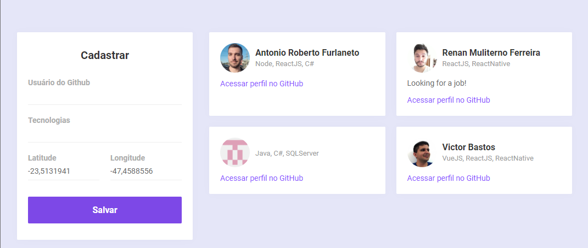
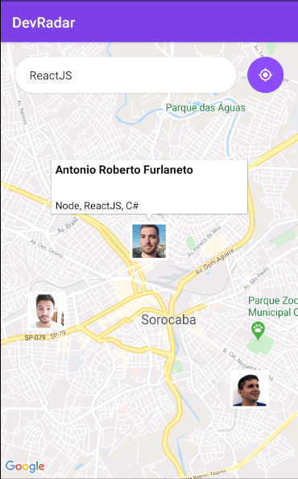
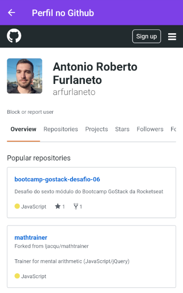

# Semana Omnistack 10

## DevRadar
Find near developers based on their programming skills.

## Technologies Used
- Node.js
- React JS
- React Native
- Expo

## Back-end
Setup your mongo instance.
You can use docker:
```bash
docker run --name mongoomnistack10 -p 27017:27017 -d -t mongo
```
Create a `.env` file with your `MONGO_URL`. You can copy from `.env.example`.
```
MONGO_URL=mongodb://localhost:27017/omnistack10
```
Install dependencies and run:
```
yarn
yarn run dev
```
Back-end runs at port 3333.

## Web
Edit `src/services/api.js` and add your back-end URL.
```
import axios from 'axios';

const api = axios.create({
    baseURL: 'http://localhost:3333'
});

export default api;

```
Install dependencies and run:
```
yarn
yarn run start
```
Front-end runs at port 3000.

## Mobile

## Screenshots
<p align="center">
  </img>
</p>
<p>
  </img>
  </img>
</p>
